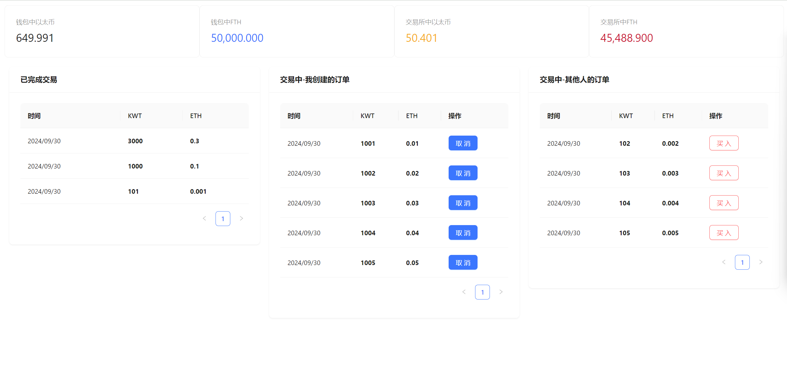

# web3-demo

Including smart contract writing, the use of the web3.js library, and practical projects of cryptocurrencies and exchanges built on Ethereum.



## Getting Started with Create React App

This project was bootstrapped with [Create React App](https://github.com/facebook/create-react-app).

### Available Scripts

In the project directory, you can run:

#### `npm start`

Runs the app in the development mode.\
Open [http://localhost:3000](http://localhost:3000) to view it in your browser.

The page will reload when you make changes.\
You may also see any lint errors in the console.

## 依赖 & 工具

- MetaMask: MetaMask是一个浏览器插件，可作为MetaMask Chrome扩展或Firefox附加组件使用。它的核心是它作为以太坊钱包：通过安装它，您将可以访问一个独特的以太坊钱包地址，您可以使用它开始发送和接收以太币或ERC20通证。
- Ganache: Ganache 是一个用与本地开发的区块链，用于在以太坊区块链上开发去中心化的应用程序。Ganache 模拟了以太坊网络。
- Web3.js: Web3.js是一个库，它有很多函数，使用它可以在以太坊生态系统中通过HTTP或IPC与本地或者以太坊远程节点交互，如查看链上信息等。各种高级语言编写的程序可以使用web3 interface来与EVM交互，在此过程中使用是的JSON-RPC（一个无状态且轻量级的远程过程调用（RPC）传送协议，其传递内容透过 JSON 为主）
- Truffle: Truffle是一个世界级的智能合约开发框架，管理智能合约的生命周期，自动化合约测试，可编程，可部署，可发布合约

```powershell
cnpm i ganache -g
ganache -d // 可以不生成新的账号

npm i truffle -g

npm i openzeppelin-solidity
npm i --save web3
npm i --save @reduxjs/toolkit
npm i --save react-redux
npm i antd --save
npm i moment
```

## 目录结构：

- contracts/ : 存放solidity智能合约文件

- migrations/ : truffle使用 migration system 来控制合约的部署。 

- test/ : 测试文件存放位置（javascript or solidity）

- truffle-config.js : 配置文件

## 执行

```powershell
// 本地环境部署
truffle migrate --reset
// 执行不同测试脚本测试功能
truffle exec .\scripts\test_order.js 
```

